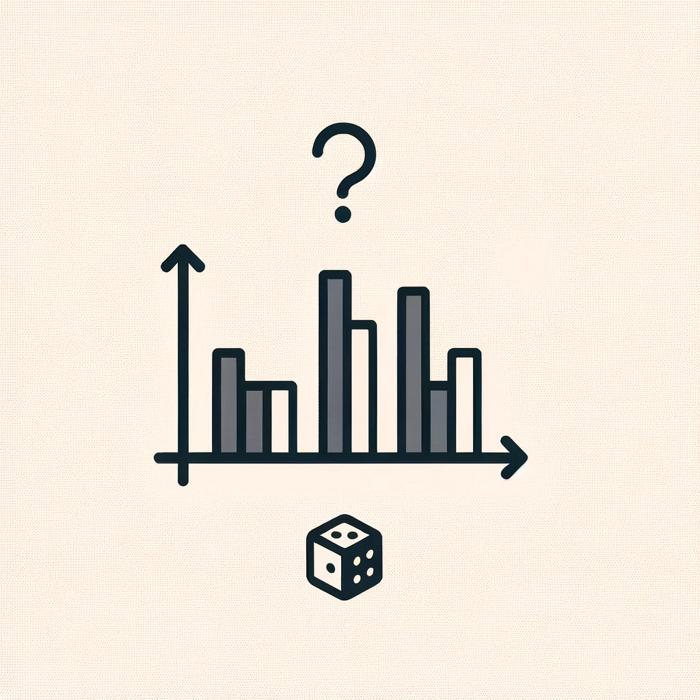

딥러닝 Classification 에서 Loss Function 으로 Cross-Entropy 를 많이 사용한다.

그 이유를 이해하기 위해 글로 남겨보았다.

## Entropy

> 「1」 『물리』 열의 이동과 더불어 유효하게 이용할 수 있는 에너지의 감소 정도나 무효(無效) 에너지의 증가 정도를 나타내는 양.
> 「2」 『정보·통신』 정보를 내보내는 근원의 불확실도를 나타내는 양.
> 「3」 『정보·통신』 정보량의 기대치를 이르는 말.
> [표준국어대사전](https://stdict.korean.go.kr/search/searchView.do?word_no=457923&searchKeywordTo=3)

---

열역학과 정보 이론 두 분야에서 공통적으로 시스템의 무질서도나 불확실성을 측정하는데 사용된다.

하지만 이런 정의로는 크게 와닿지 않았다.

### 예시 1.

-   날씨는 화창한 날씨, 비오는 날씨일 확률이 각각 50%이다.
-   기상관측소가 오늘의 날씨를 둘 중 하나로 예측한다.
-   불확실성이 반으로 줄어든다.
-   똑같은 가능성의 두 가지 옵션이 있었는데, 예측 후 하나만 남았다.

이 때, 기상관측소는 정보를 전송하는데 1 bit를 썼다. (화창한 날씨인지, 비오는 날씨인지)

### 예시 2.

-   날씨는 총 8가지 가능성이 있고, 모두 동일한 확률을 가지고 있다. (12.5%)

이 때, 기상관측소는 정보를 전송하는데 3 bit로 모든 확률을 나타낼 수 있다. ($2^3$)

전달되는 Bit 수는 이진 로그와 전체 확률을 통헤 쉽게 찾을 수 있다.

### 예시 3.

-   만약 해당 날씨일 확률이 동일하지 않다면 ?
-   화창한 날씨는 75%, 비오는 날씨는 25%일 경우를 생각해보자.
-   1) 기상관측소에서 내일 비가 올 것이라 예측한다면, 불확실성은 4배, 즉 2비트 정보만큼 감소한다.
    -   불확실성의 감소는 사견 확률의 역수! 비 올 확률이 25%, 불확실성은 1/0.25 -> $\\log\_2(4) = -\\log\_2(0.25)$
-   2) 기상관측소에서 내일 날씨가 맑을 것이라 예측한다면, 불확실성은 1.33배, 0.41비트만큼 감소한다.
    -   마찬가지로 기상관측소는 0.41비트 전송으로 정보를 전송할 수 있다.
-   평균적으로 생각해보면 화창한 경우 \* 전송비트(0.41) + 비오는 경우 \* 전송비트(2) = 0.81 bit
-   매일 기상관측소는 0.81 비트를 전송한다.

위 예시들에서 우리가 계산한 불확실성을 Entropy 라고 한다.

Entropy 가 높으면 정보가 많고, 사건 별 확률이 낮아 어떤 정보일지 불확실하게 되는 경우이다.

(확률 분포가 얼마나 예측할 수 없는지 알려줌)

날씨가 거의 일정한 극지방이나 적도 지방에서 날씨 엔트로피는 0에 가깝다. 하지만, 날씨의 변화가 많은 곳은 예측하기 힘드므로 엔트로피가 커진다.

$$H(p) = -\\sum\_i p\_i \\log\_2(p\_i)$$

## Cross-Entropy

Cross-Entropy는 Entropy의 개념을 확장한다. 보낸 사람이 받는 사람엑세 전달한 메시지 (bit)의 평균 길이를 나타낸다.

### 예시 4.

-   이 전 예시 2에서 처럼 모두 동일한 확률을 가진 8가지 날씨를 3 bit 로 정보를 전송한다고 생각해보자.
-   모든 메시지는 3 비트를 갖게되고, 평균 메시지 길이도 3 비트가 된다. (Cross-Entropy = 3)

### 예시 5.

-   모든 날씨의 확률이 다르다면!
-   이 전 예시 3에서 처럼 각 날씨마다 전송하는 비트의 수가 확률마다 다르게 된다.
-   예를 들어 각 날씨의 확률이 (35%, 35%, 10%, 10%, 4%, 4%, 1%, 1%) 일 때,
-   $Entropy = -0.35\\log\_2(0.35) + ... + -0.01\\log\_2(0.01) = 2.23$ 이 된다.

(Cross-entropy changed by true distribution and predicted distribution) 보충하기!

$$ H(p,q) = -\\sum\_i p\_i \\log\_2(q\_i) $$

만약 완벽하게 예측했다면 Cross-entropy는 Entropy 와 같다.

## KL Divergence

Cross-Entropy = Entropy + KL Divergence

(보충하기)

참고

1.  [https://gombru.github.io/2018/05/23/cross\_entropy\_loss/](https://gombru.github.io/2018/05/23/cross_entropy_loss/)
2.  [https://www.youtube.com/watch?v=ErfnhcEV1O8](https://www.youtube.com/watch?v=ErfnhcEV1O8)
3.  [위키백과](https://ko.wikipedia.org/wiki/%EC%A0%95%EB%B3%B4_%EC%97%94%ED%8A%B8%EB%A1%9C%ED%94%BC)
4.  [A Mathmetical Theory of Communication](https://pure.mpg.de/rest/items/item_2383164/component/file_2383163/content)
